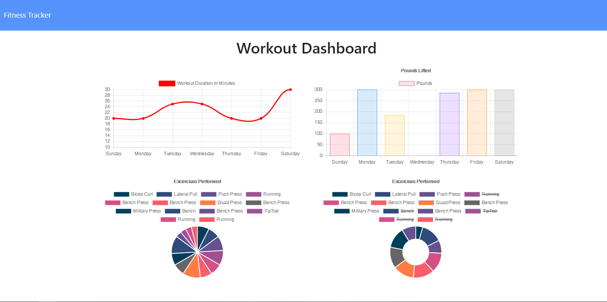

# Unit 17 Nosql Homework: Workout Tracker

For this assignment from my Georgia Tech Bootcamp, I handled creating the backend for a workout tracker. I was provided the front end code and created a Mongo database with a provided Mongoose schema to handle the routes with Express.

**Live Demo:** https://workout-tracker206.herokuapp.com/

